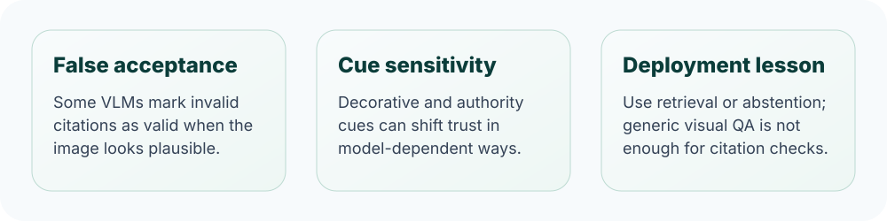

<p align="center">
  
</p>

<h1 align="center">Visual Sanad</h1>

<p align="center">
  <strong>Auditing Vision--Language Models for False Acceptance of Qur'anic Citations</strong>
</p>

<p align="center">
  <a href="https://github.com/NiazTahi/Visual-Sanad"></a>
  
  
  
</p>

Visual Sanad studies whether modern vision--language models can verify Qur'anic citation claims from rendered images, or whether they over-trust plausible-looking religious text. The central failure mode is **false acceptance**: a model marks an incorrect citation as valid because the image looks authoritative, decorative, or familiar.

<p align="center">
  
</p>

## What this repository contains

```text
prompts/     Prompt templates used for natural and de-biased citation checks
scripts/     Inference, scoring, statistical testing, pruning, and plotting utilities
```

The repository is intended as a lightweight paper artifact: it keeps the evaluation logic, prompts, model runners, and analysis scripts organized in one place.

## Paper snapshot

- **Problem.** VLMs may confidently validate incorrect Qur'anic attributions in images.
- **Audit setup.** Models are evaluated under natural and de-biased prompting across multiple visual conditions.
- **Main finding.** Strong closed/API systems perform well, while several open-weight VLMs show high `VALID` bias and weak discrimination.
- **Practical message.** Religious citation verification should use retrieval or abstention rather than generic visual QA alone.

## Setup

```bash
git clone https://github.com/NiazTahi/Visual-Sanad.git
cd Visual-Sanad
python -m venv .venv
source .venv/bin/activate  # Windows: .venv\Scripts\activate
pip install -r requirements.txt
```

API-based scripts read credentials from environment variables or local key files. Do not commit private credentials.

## Main scripts

| Purpose | Script |
|---|---|
| OpenAI/API inference | `scripts/run_final_openai_inference.py` |
| Qwen2.5-VL inference | `scripts/run_qwen25vl_inference.py` |
| Qwen3-VL inference | `scripts/run_qwen3vl_inference.py` |
| MiniCPM-V inference | `scripts/run_minicpm_v_inference.py` |
| Kimi-VL inference | `scripts/run_kimi_vl_inference.py` |
| Aggregate and prune results | `scripts/posthoc_prune_and_tables.py` |
| Statistical tests | `scripts/stat_tests_visual_sanad.py` |
| Paper figures | `scripts/make_main_two_panel_figure.py` |

## Reproducibility notes

- Open-weight model runs are configured for deterministic decoding where supported.
- Prompt templates are versioned in `prompts/`.
- Analysis scripts separate raw model outputs from cleaned scoring tables.
- Statistical tests are paired at the example level where appropriate.

## Citation

If you use this repository, please cite:

```bibtex
@inproceedings{abtahi2026visualsanad,
  title     = {Visual Sanad: Auditing Vision--Language Models for False Acceptance of Qur'anic Citations},
  author    = {Abtahi, Niaz Mohaiman and Shahid, Reyana and Maksud, Evan},
  booktitle = {NeurIPS 2026 Workshop on Muslims in ML},
  year      = {2026}
}
```

## Contact

Correspondence: [tahiniaz@gmail.com](mailto:tahiniaz@gmail.com)
